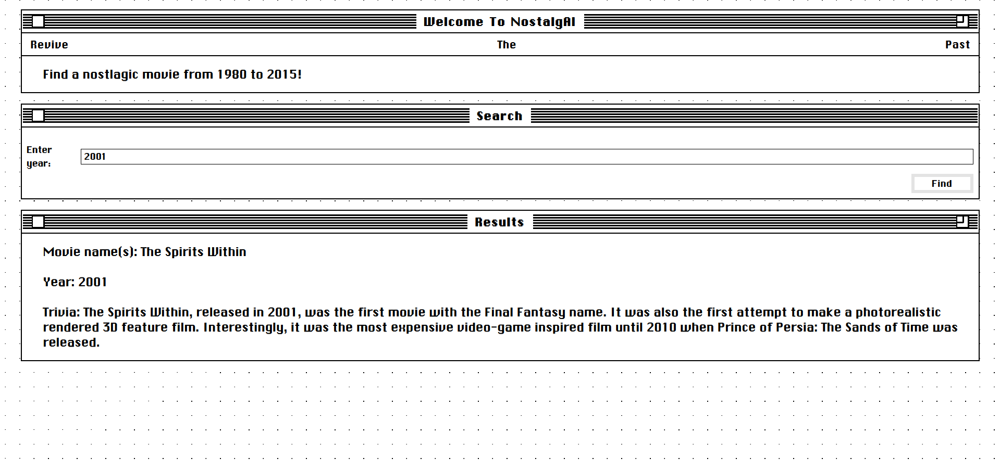

# UofT Hack 11 - NostalgAI
Team: [Siddhant Das](https://github.com/Sid-26), [Sheida Ebrahimi](https://github.com/Sheida-Ebrahimi)

## Overview
This web application combines Cohere AI and Svelte to deliver a nostalgic movie recommendation website. When users input a year, they will be recommended a movie of that particular year, including some relative trivia using Cohere. 

## Pre-requisites
* Python
* Docker

## How To Use
<ol>
  <li>Clone this repository</li>
  <li>Make your current working directory<code>/backend</code></code></li>
  <li>Run <code>docker build -t nostalgia .
</code></li>
  <li>Run <code>docker run -p 5000:5000 nostalgia</code></li>
  <li>Go to https://uhacks11.vercel.app</li>
</ol> 

To exit the server use: ```ctrl + c```


## Screenshot


## Credits
Theme: https://github.com/sakofchit/system.css

